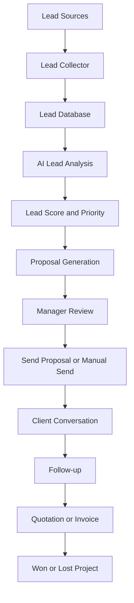
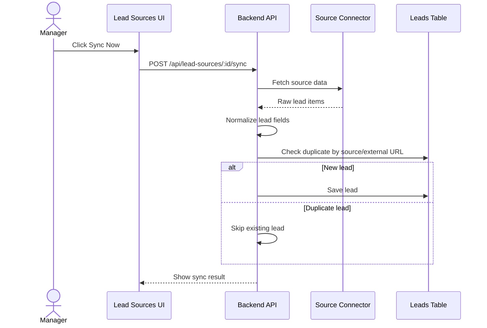
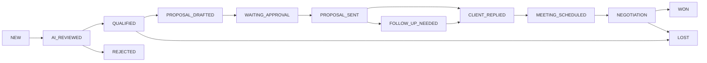
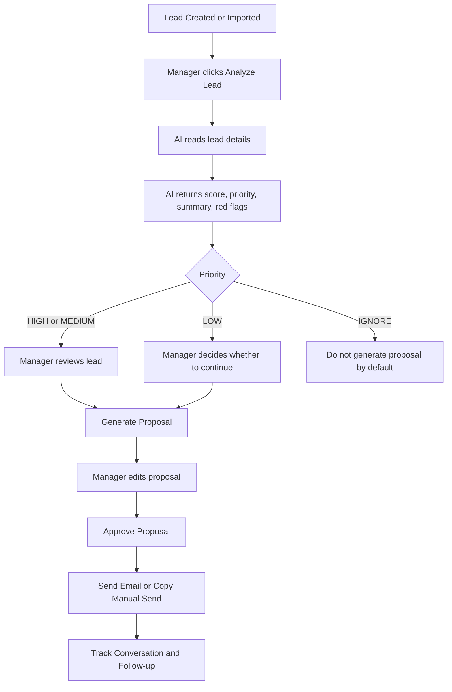
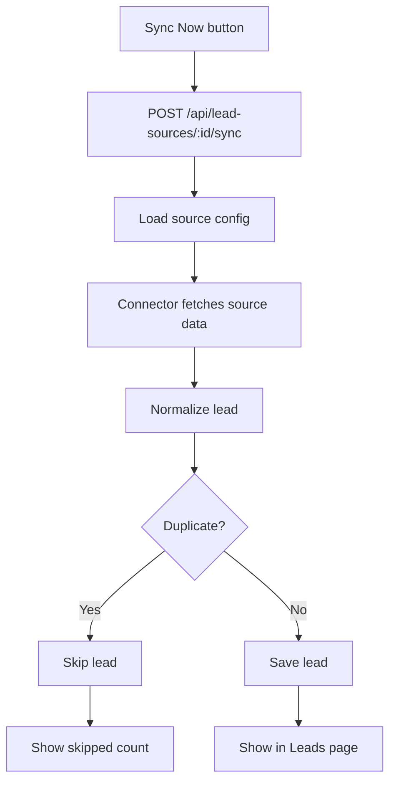

# LeadForge AI — Complete Project Flow and Action Notes

## 1. Project Overview

LeadForge AI, also called AI Project Hunter, is a lead collection and proposal management system for a software services company.

The project helps the company find freelance and remote software project opportunities, qualify them, prepare proposals, track client replies, follow up, create quotations and invoices, and finally convert good leads into paid projects.

The business problem is simple: project opportunities are spread across many places such as job boards, RSS feeds, email alerts, freelance platforms, referrals, and manual messages. Without one system, managers waste time checking many sites, miss follow-ups, duplicate work, and do not know which leads can become revenue.

The end goal is:

1. Collect freelance and remote project leads.
2. Analyze each lead with AI.
3. Score and prioritize the best opportunities.
4. Generate a strong proposal draft.
5. Let a manager review and approve the proposal.
6. Send the proposal manually, by email, or by approved platform flow.
7. Track client conversations and follow-ups.
8. Create quotation and invoice when the client agrees.
9. Mark the project as won or lost.

## 2. High-Level Business Flow

The business flow starts with lead sources and ends with revenue. Every step has a purpose.

Why this flow exists:

- Lead Sources collect possible project opportunities from many places.
- Lead Collector imports them into one format.
- Lead Database keeps all opportunities in one searchable place.
- AI Lead Analysis saves manager time by checking quality.
- Lead Score and Priority tells the team what to act on first.
- Proposal Generation creates a first draft quickly.
- Manager Review protects quality and platform accounts.
- Send Proposal starts the sales conversation.
- Client Conversation stores the full history.
- Follow-up prevents lost opportunities.
- Quotation and Invoice move the deal toward payment.
- Won or Lost status shows real business result.

## 3. Lead Sources Explanation

The Lead Sources page is used to manage where new project leads come from. A source can be an RSS feed, API, Gmail alert, manual entry, or a future approved integration.

Source types:

| Source type | Purpose |
| --- | --- |
| RSS feeds | Pull public project or job posts from RSS URLs. |
| Remote job boards | Collect remote software work from supported boards. |
| Freelancer API | Fetch Freelancer.com leads through official API credentials when implemented. |
| Gmail alerts | Import leads from platform alert emails. |
| Manual Entry | Let a manager or admin enter a lead by hand. |
| Upwork Gmail alerts | Use email alerts instead of direct scraping. |
| Fiverr Gmail alerts | Use email alerts instead of direct scraping. |
| LinkedIn Gmail alerts | Use email alerts instead of direct scraping. |
| Indeed Gmail alerts | Use email alerts instead of direct scraping. |

Some sources are ACTIVE and some are DISABLED.

- ACTIVE means the connector is ready or can be synced.
- DISABLED means the source is a placeholder, future connector, or not ready for safe use.
- Upwork, Fiverr, LinkedIn, and Indeed should not be scraped directly. Use Gmail alerts, approved APIs, partner flows, or manual entry.
- Freelancer API requires a real API connector and valid credentials before it can fetch live data.

Lead Sources actions:

| Action | What it does | Why we use it |
| --- | --- | --- |
| Add RSS | Adds a new RSS feed URL as a source. | It lets the team collect leads from a new public feed without code changes. |
| Test | Checks whether the source can be reached and parsed. | It prevents bad sources from creating sync failures. |
| Sync Now | Starts an immediate import from that source. | It lets a manager fetch fresh leads on demand. |
| Activate | Enables the source for testing or syncing. | It makes a ready source available for lead collection. |
| Disable | Turns off a source. | It stops broken, unsafe, duplicate, or future sources from running. |
| Edit Config | Updates URL, type, credentials, or source settings. | It keeps the connector correct when source details change. |

## 4. How Leads Are Fetched

The Lead Collector does not use AI to fetch leads. Fetching is done by backend connectors such as RSS, API, email parser, or manual entry. AI is used later to analyze and write proposals.

Technical flow:

Step purpose:

- Sync Now starts the import manually.
- `POST /api/lead-sources/:id/sync` sends the request to the backend.
- Connector fetches source data from RSS, API, email, or another supported method.
- Normalize lead converts different source formats into one common lead format.
- Duplicate check prevents the same opportunity from being imported again.
- Save lead stores only new opportunities.
- Leads page shows the imported leads for review.

## 5. Supported Lead Collection Methods

| Source | Current Method | Status | Notes |
| --- | --- | --- | --- |
| We Work Remotely RSS | RSS connector | Working/tested | Good for remote software job feeds. |
| RemoteOK | RSS or generic feed connector if configured | Implemented if feed URL is available | Use RSS/API style import, not browser scraping. |
| Generic RSS | RSS connector | Working for valid feeds | Best simple option for public feeds. |
| Manual Entry | Form entry | Working | Useful for referrals, WhatsApp, emails, and unsupported platforms. |
| Freelancer API | Official API connector | Future/needs credentials | Requires real API key and approved implementation. |
| Upwork Gmail Alerts | Gmail/email parser | Future | Safer than scraping Upwork directly. |
| Fiverr Gmail Alerts | Gmail/email parser | Future | Manager replies inside Fiverr after review. |
| LinkedIn Gmail Alerts | Gmail/email parser | Future | Avoid direct scraping; use alerts or manual entry. |
| Indeed Gmail Alerts | Gmail/email parser | Future | Use alerts, approved partner flow, or manual entry. |

## 6. Lead Page Explanation

The Leads page is where the team views, searches, filters, creates, analyzes, and moves leads through the business pipeline.

Lead fields:

| Field | Meaning | Purpose |
| --- | --- | --- |
| Title | Project or job title. | Helps the team quickly understand the requirement. |
| Source | Where the lead came from. | Shows which channel is producing opportunities. |
| Client name | Name of client or company if known. | Makes proposals and conversations more personal. |
| Client country | Client location if known. | Helps estimate timezone, budget fit, and communication style. |
| Client email | Email address if available. | Allows direct proposal or invoice email. |
| Project URL | Original link to the opportunity. | Lets manager verify the source and apply manually if needed. |
| Budget min | Minimum expected budget. | Helps check whether the project is worth pursuing. |
| Budget max | Maximum expected budget. | Helps estimate revenue potential. |
| Currency | Currency for the budget. | Prevents confusion in quotation and invoice planning. |
| Skills | Required skills or technologies. | Helps match the work to company capability. |
| Description | Full project details. | Gives AI and manager enough context to qualify the lead. |

Lead actions:

| Action | Purpose |
| --- | --- |
| Create Lead | Manually add an opportunity from any source. |
| Search leads | Quickly find leads by title, client, or details. |
| Filter by source | See which source produced the lead. |
| Filter by status | Focus on leads in a specific pipeline stage. |
| Filter by priority | Work on HIGH priority leads first. |
| View lead | Open full details before making a decision. |
| Analyze Lead | Ask AI to score and summarize the opportunity. |
| Generate Proposal | Create a proposal draft for a qualified lead. |
| Mark Qualified | Confirm the company should pursue the lead. |
| Mark Won | Mark the project as converted into business. |
| Mark Lost | Close a lead that did not convert. |

## 7. Manual Lead Entry Flow

Manual entry lets an admin or manager add a lead from any platform or conversation.

This is useful when:

- The platform does not support API access.
- Scraping is unsafe or not allowed.
- The lead came from Fiverr, Upwork, LinkedIn, WhatsApp, email, referral, or phone call.
- The manager wants to track the lead inside the same CRM flow.

After manual entry, the lead can still be analyzed by AI, scored, given a priority, and used for proposal generation.

## 8. AI Lead Analysis

AI Lead Analysis starts after a lead exists in the database. The AI model reads the title, description, budget, skills, platform/source, and client details.

The AI checks:

- Is this a real software project?
- Does it match company skills?
- Is the budget useful for the company?
- Does the client look serious?
- Are there red flags such as unclear scope, very low budget, spam, or risky terms?

AI returns:

| Output field | Purpose |
| --- | --- |
| `lead_score` | Numeric score showing opportunity quality. |
| `priority` | HIGH, MEDIUM, LOW, or IGNORE decision. |
| `category` | Type of work such as web app, mobile app, AI, CRM, automation. |
| `required_skills` | Skills needed to deliver the project. |
| `budget_quality` | Budget judgment such as good, average, low, or unclear. |
| `client_seriousness` | Estimate of how serious the client appears. |
| `red_flags` | Risks the manager should review. |
| `ai_summary` | Short explanation of the opportunity. |
| `recommended_action` | Next business action for the team. |

Scoring:

| Score | Priority | Meaning |
| --- | --- | --- |
| 80-100 | HIGH | Apply quickly. This is a strong opportunity. |
| 60-79 | MEDIUM | Manager should review and decide. |
| 40-59 | LOW | Low priority; act only if time allows. |
| Below 40 | IGNORE | Usually not worth proposal effort. |

## 9. AI Proposal Generation

AI generates a proposal only after a lead is analyzed or when a manager manually requests it. The proposal is a draft, not an automatic send.

A proposal should include:

- Client-specific opening.
- Understanding of the requirement.
- Technical solution.
- Suggested tech stack.
- Timeline.
- Budget range.
- Clarification questions.
- Portfolio links when available.

Proposal actions:

| Action | Purpose |
| --- | --- |
| Generate Proposal | Creates the first proposal draft from lead details and AI analysis. |
| Proposal editor | Lets the manager improve wording, scope, budget, and questions. |
| Approve proposal | Confirms the proposal is ready to send. |
| Reject proposal | Blocks a weak or incorrect proposal. |
| Copy proposal | Copies text for manual sending on a platform. |
| Mark as sent | Records that the proposal has been sent to the client. |

Business rules:

- Do not auto-generate proposals for IGNORE leads.
- For low-score leads, manager approval should be required before creating or sending a proposal.
- Never auto-send a proposal without manager approval.

## 10. Proposal Sending Flow

Sending depends on the lead source. AI can draft the proposal, but the manager controls the final send.

| Source | How to Send Proposal |
| --- | --- |
| Freelancer | Use API/bid if implemented; otherwise send manually. |
| Remote job board | Email if available, or use the apply link manually. |
| Upwork | Manager sends inside Upwork or through approved API. |
| Fiverr | Manager replies inside Fiverr. |
| LinkedIn | Manager sends manually through LinkedIn or email. |
| Indeed | Manager applies manually or uses approved partner flow. |
| Manual Entry | Send by email, phone, WhatsApp, or manual platform message. |

Why human control matters:

- It protects platform accounts.
- It avoids spam-like behavior.
- It lets the manager adjust tone and pricing.
- It prevents AI mistakes from reaching clients.

## 11. Conversation Tracking

Conversation Tracking stores messages between the company and the client.

Once the client replies, the manager or admin can enter the message manually or sync it from an integration when available. The conversation page keeps the full client journey in one place.

Conversation actions:

| Action | Purpose |
| --- | --- |
| Add client message | Record what the client said. |
| Generate AI reply | Draft a response based on lead and history. |
| Send email if client email exists | Send directly when email is available and approved. |
| Copy manual reply | Copy the message for LinkedIn, Upwork, Fiverr, WhatsApp, or another platform. |
| Mark client replied | Move the lead to the correct CRM stage. |

## 12. Follow-up Flow

Follow-ups are reminders when the client does not reply after a proposal or message.

After a proposal is sent, a follow-up can be scheduled. AI can write a short professional follow-up, but the manager should review and send it. If the client replies, pending follow-ups should stop.

Follow-up actions:

| Action | Purpose |
| --- | --- |
| Create follow-up | Schedule a reminder for a lead. |
| Generate follow-up | Ask AI to draft a follow-up message. |
| Complete follow-up | Mark the reminder done after sending. |
| Cancel follow-up | Stop reminders when they are no longer needed. |

## 13. CRM Pipeline

The CRM pipeline tracks every lead from first discovery to final business result.

Stages:

| Stage | Meaning |
| --- | --- |
| NEW | Lead was created or imported. |
| AI_REVIEWED | AI analysis has been completed. |
| QUALIFIED | Manager decided the lead is worth pursuing. |
| PROPOSAL_DRAFTED | Proposal draft exists. |
| WAITING_APPROVAL | Proposal needs manager approval. |
| PROPOSAL_SENT | Proposal has been sent or copied for sending. |
| CLIENT_REPLIED | Client responded. |
| FOLLOW_UP_NEEDED | Client has not replied and needs follow-up. |
| MEETING_SCHEDULED | Meeting or call is planned. |
| NEGOTIATION | Scope, price, or timeline is being discussed. |
| WON | Project is won. |
| LOST | Project is lost. |
| REJECTED | Lead was rejected by manager or system. |

CRM purpose:

- Track every lead from discovery to result.
- Know which projects are active.
- Know which proposals are waiting for approval.
- Know where follow-ups are due.
- Know the revenue pipeline.

## 14. Quotation and Invoice Flow

When a client agrees, the manager creates a quotation. The quotation defines the business offer.

A quotation includes:

- Scope of work.
- Timeline.
- Amount.
- Currency.
- Payment terms.
- Validity or approval details.

After the quotation is accepted, finance or admin can create an invoice. The invoice is used to request and track payment.

Quotation statuses:

| Status | Meaning |
| --- | --- |
| DRAFT | Quotation is being prepared. |
| SENT | Quotation was sent to the client. |
| ACCEPTED | Client accepted it. |
| REJECTED | Client rejected it. |

Invoice statuses:

| Status | Meaning |
| --- | --- |
| UNPAID | Invoice is sent but not paid. |
| PARTIALLY_PAID | Some payment was received. |
| PAID | Full payment was received. |
| OVERDUE | Payment date passed. |
| CANCELLED | Invoice is no longer valid. |

## 15. Admin and Manager Roles

| Role | What they do | Business purpose |
| --- | --- | --- |
| Admin | Manages users, sources, settings, and full system access. | Keeps the system controlled and secure. |
| Manager | Reviews leads, approves proposals, sends/copies proposals, manages pipeline. | Makes business decisions and protects client quality. |
| BD Executive | Adds leads, follows up, updates conversations, helps with proposals. | Moves sales work forward daily. |
| Finance | Creates invoices, sends payment emails, tracks payment status. | Converts won projects into collected revenue. |
| Technical Reviewer | Checks feasibility, scope, timeline, and tech stack. | Prevents unrealistic promises before proposal approval. |

## 16. Dashboard Explanation

Dashboard cards:

| Card | Purpose |
| --- | --- |
| Total Leads | Shows all leads in the system. |
| New Leads | Shows fresh opportunities that need review. |
| Qualified Leads | Shows leads worth pursuing. |
| Proposals Sent | Shows sales activity already completed. |
| Client Replies | Shows active client interest. |
| Won Projects | Shows successful conversions. |
| Revenue Pipeline | Shows possible upcoming revenue. |
| Follow-ups Due | Shows work that must be done today or soon. |

The dashboard is useful because it gives a daily business view. Managers can see lead performance, proposal status, follow-up work, and revenue movement without opening every module.

## 17. Current Working Status

Current implemented or base modules in this project:

- Admin dashboard UI.
- Lead Sources UI.
- RSS sync.
- Manual Entry.
- Lead list.
- Lead detail.
- AI lead analysis.
- AI proposal generation.
- CRM status and pipeline.
- Conversation base module.
- Follow-up base module.
- Quotation base module.
- Invoice base module.

Current tested or intended working sources:

- We Work Remotely RSS.
- RemoteOK or Generic RSS if configured with a valid feed.
- Manual Entry.

## 18. Pending / Future Work

Pending or future improvements:

- Auto-analyze after sync.
- Auto-generate proposal only for high-score leads.
- Better keyword filtering.
- Gmail parser for Upwork, Fiverr, LinkedIn, and Indeed.
- Real Freelancer API connector.
- Conversation sync.
- Email sending improvements.
- Calendar meeting scheduling.
- Portfolio selector.
- Team matching.
- Revenue analytics.
- Production deployment.

## 19. Important Safety Rules

Safety rules:

- Do not scrape Upwork, Fiverr, LinkedIn, or Indeed directly.
- Use approved APIs, RSS, Gmail alerts, partner flows, or manual import.
- Never auto-send proposals without manager approval.
- Never expose API keys.
- Keep `.env` files out of GitHub.
- AI should draft; manager should approve.

These rules protect accounts, client relationships, credentials, and company reputation.

## 20. End-to-End Example

A We Work Remotely RSS feed contains a React Native project.

The system imports the job during RSS sync. The duplicate checker confirms the opportunity is new, so the lead is saved in the Leads table. AI analyzes the title, description, budget, and skills, then gives the lead a score of 85. Because 85 is high, AI marks it HIGH priority and recommends applying quickly.

The manager opens the lead, reviews the AI summary, and generates a proposal. AI writes a proposal with a client-specific opening, requirement understanding, React Native solution, timeline, budget range, and clarification questions.

The manager edits and approves the proposal. The manager sends it through email, apply link, or manual platform message depending on the source. The client replies, and the conversation is stored. The manager schedules a meeting, agrees on scope, creates a quotation, sends an invoice, and marks the project as WON after the deal is confirmed.

## 21. Technical API Flow

Important API endpoints:

Lead Sources:

- `GET /api/lead-sources`
- `POST /api/lead-sources`
- `PATCH /api/lead-sources/:id`
- `POST /api/lead-sources/:id/test`
- `POST /api/lead-sources/:id/sync`

Leads:

- `GET /api/leads`
- `POST /api/leads`
- `GET /api/leads/:id`
- `POST /api/leads/:id/analyze`
- `POST /api/leads/:id/generate-proposal`
- `PATCH /api/leads/:id/status`

Proposals:

- `GET /api/proposals`
- `POST /api/proposals/:id/approve`
- `POST /api/proposals/:id/reject`
- `POST /api/proposals/:id/mark-sent`

CRM:

- `GET /api/crm/pipeline`
- `POST /api/crm/move-stage`

Conversations:

- `GET /api/conversations/:leadId`
- `POST /api/conversations/:leadId/messages`

Followups:

- `GET /api/followups`
- `POST /api/followups`
- `POST /api/followups/:id/complete`

Quotations and invoices:

- `POST /api/quotations/generate`
- `POST /api/invoices`
- `POST /api/invoices/:id/send-email`
- `POST /api/invoices/:id/mark-paid`

## 22. AI Analysis and Proposal Flow

## 23. Lead Source Sync Flow

## 24. Final Summary

LeadForge AI helps the company collect projects, qualify opportunities, prepare proposals, track communication, follow up, and win paid software projects.
